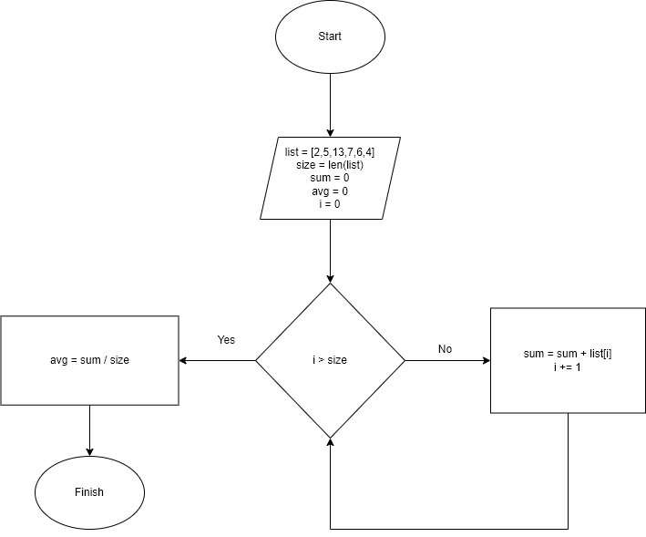

# Задача 2. Напишите псевдокод по блок-схеме
# Найти среднее арифметическое среди всех элементов массива [2, 5, 13, 7, 6, 4]

    list = [2,5,13,7,6,4]
    size = len(list)
    sum = 0
    avg = 0
    i = 0
    for i < size:
        sum = sum + list[i]
        i += 1
    avg = sum / size
    print(avg)

---

